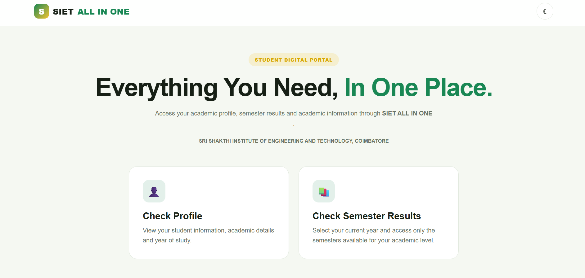
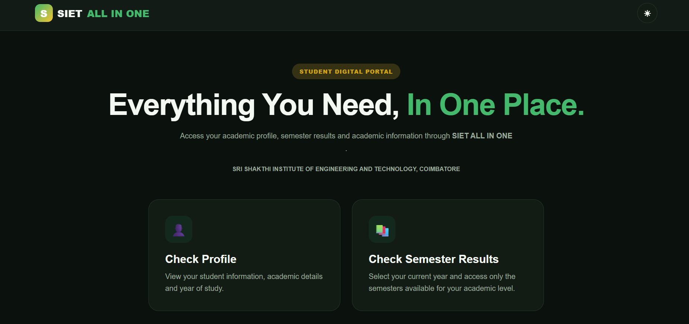
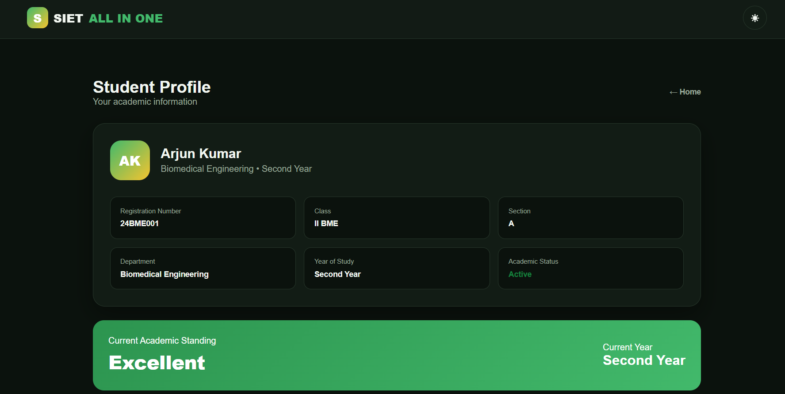
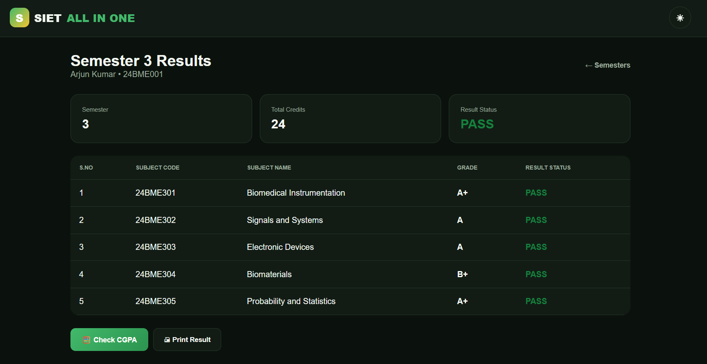
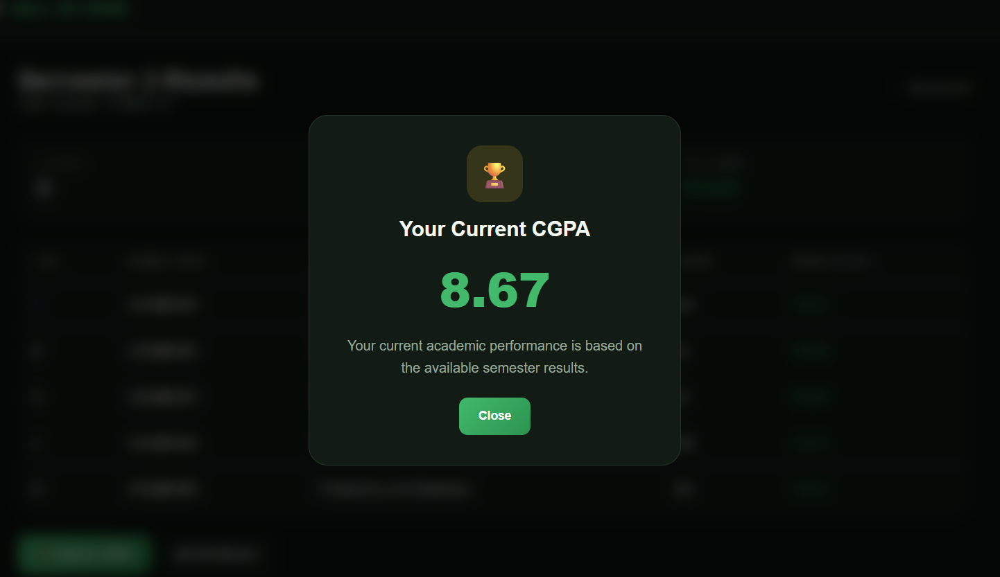

# SIET ALL IN ONE

### Student Academic Profile & Semester Result Portal

🌐 **Live Demo:**  
https://manikandanramadoss07.github.io/SIET_All_in_one/

---

## About the Project

**SIET ALL IN ONE** is a student-focused web portal designed to provide a simple and modern interface for accessing academic information.

The portal allows students to view their profile, select available semesters according to their year of study, access semester examination results, check their CGPA and print their results.

This is my first attempt at building a complete web application from scratch. The project was created while learning frontend development, UI design, JavaScript, Git and GitHub.

---

## Features

- Student profile
- Year-based semester selection
- Semester-wise results
- Student login interface
- Subject-wise grades
- Pass / Arrear status
- CGPA viewing
- Print result functionality
- Light mode
- Dark mode
- Green & yellow themed interface
- Responsive design
- GitHub Pages deployment

---

## Smart Semester Selection

The available semesters are based on the student's year of study.

| Year | Available Semesters |
|---|---|
| First Year | Semester 1 – 2 |
| Second Year | Semester 1 – 4 |
| Third Year | Semester 1 – 6 |
| Fourth Year | Semester 1 – 8 |

---

## Screenshots

### Home — Light Mode



### Home — Dark Mode



### Student Profile



### Semester Results



### CGPA



---

## Technology Stack

- HTML5
- CSS3
- JavaScript
- Visual Studio Code
- Git
- GitHub
- GitHub Pages

---

## Project Structure
```text
SIET_All_in_one/
│
├── index.html
│
├── README.md
│
└── screenshots/
    ├── home-light.png
    ├── home-dark.png
    └── profile.png
```
## 🧪 Demo Data

The current version uses **fictional demonstration data**.

> ⚠️ **Prototype Notice**  
> This project is a prototype and is not connected to the official student information system.

🔒 **Privacy Note:** No real student records, passwords, or private academic information should be added to this public repository.

---

## 📚 What I Learned

Through this project, I learned the fundamentals of:

- 🌐 Building a web interface
- 🧱 HTML structure
- 🎨 CSS styling
- ⚡ JavaScript interactions
- 🌗 Dark/light mode
- 🎓 Dynamic semester selection
- 📊 Result table generation
- 🖨️ Browser print functionality
- 🔧 Git version control
- 🐙 GitHub
- 🚀 GitHub Pages deployment

---

## 🔮 Future Improvements

- 🔐 Secure backend authentication
- 🗄️ Database integration
- 👨‍💼 Admin dashboard
- 📅 Attendance tracking
- 📝 Internal marks
- 📈 SGPA calculation
- 📊 Academic performance graphs
- 🔔 Notifications
- 📱 Mobile application
- 🤖 AI-powered academic insights

---

## ⚠️ Disclaimer

> **Educational Prototype**
>
> This is an educational prototype and my **first attempt at building a student portal**.
>
> The application is **not an official application of Sri Shakthi Institute of Engineering and Technology**.
>
> All academic information currently displayed is **fictional demonstration data**.

---

## 👨‍💻 Author

### **Manikandan R S**

**II Year**  
**Biomedical Engineering**  
Sri Shakthi Institute of Engineering and Technology, Coimbatore

---

<div align="center">

### 🟢 SIET ALL IN ONE

**Student Academic Profile & Semester Result Portal**

*Built as a learning project*

